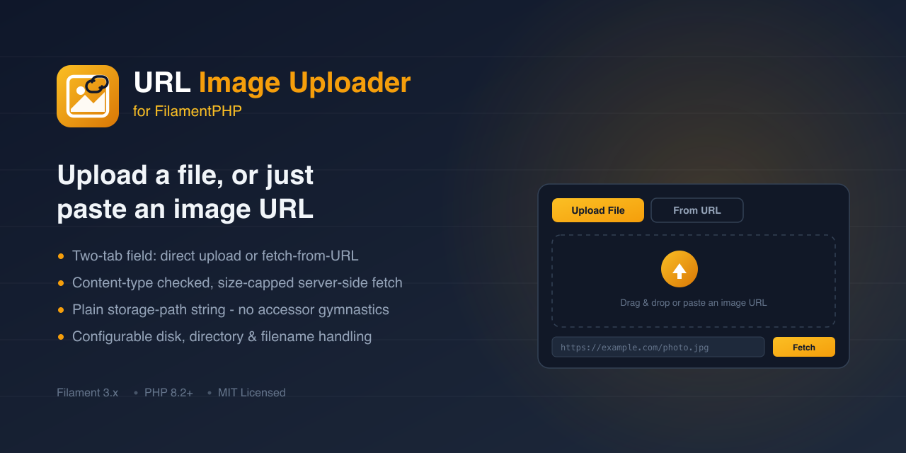

# Filament URL Image Uploader



A powerful Filament PHP form component that enables seamless image uploads from URLs. Features include image validation, preview functionality, and easy integration with Laravel storage. Perfect for remote image imports, content management, and e-commerce applications built with FilamentPHP.

## Installation

You can install the package via composer:

```bash
composer require amjadiqbal/filament-url-image-uploader
```

## Usage

```php
use AmjadIqbal\FilamentUrlImageUploader\Components\UrlImageUploader;

UrlImageUploader::make('image')->directory('images');
```

The field renders two tabs — upload a file directly, or paste an image URL and fetch it server-side.
Either way, the value saved to your model attribute is always a plain storage path string (e.g.
`"images/example.jpg"`), never an array — no accessor/mutator gymnastics required on your model:

```php
// database column: image (string, nullable)

class Post extends Model
{
    protected $fillable = ['image'];
}
```

To render the stored image elsewhere in your app, resolve it through the disk you configured:

```php
Storage::disk('public')->url($post->image);
```

## Configuration

### Directory
You can customize the storage directory:
```php
UrlImageUploader::make('image')->directory('custom/path/here');
```

### Disk
By default, files are stored on the `public` disk. You can target any configured disk:
```php
UrlImageUploader::make('image')->disk('s3');
```

### Preserve original filenames
```php
UrlImageUploader::make('image')->preserveFilenames();
```

### URL fetch size limit
The "URL Upload" tab downloads the remote image server-side before validating its content type. By
default, downloads larger than 10 MB are rejected; adjust it with:
```php
UrlImageUploader::make('image')->maxUrlFetchSize(5 * 1024 * 1024); // 5 MB
```

## Scope

`UrlImageUploader` manages a single image per field. It does not currently support Filament's
`multiple()` mode — for a gallery of several images, use one `UrlImageUploader` per image, or a
`Repeater` of them.

### Using it in a Repeater (image gallery)

```php
use Filament\Forms\Components\Repeater;

Repeater::make('gallery')
    ->schema([
        UrlImageUploader::make('image')->directory('gallery'),
    ])
    ->reorderable()
    ->addable()
    ->deletable();
```

Each row gets its own instance of the field, so adding, deleting, and reordering rows keeps every
image with its own row — covered by a dedicated Testbench/Livewire suite
(`tests/Feature/RepeaterGalleryTest.php`) exercising fresh multi-image upload, a no-op edit-and-save
across separate page loads, deleting a middle row, reordering, adding a row to an existing gallery,
and deleting-then-adding (to catch a resurrected "deleted" image).

**Gotcha:** while a row is being edited, its live state is the field's internal `{path, url}`
shape, not the flat string your model attribute ends up with — that flat string only exists after
dehydration. If you add an `itemLabel()` (or a header) that reads the row's image value directly,
e.g. `fn (array $state) => $state['image']`, it will receive that nested array while the form is
open and throw a type error the moment you type-hint a `string` return. Read
`$state['image']['path'] ?? null` (an array) if you need a label from it, or avoid keying the label
off this field at all.

## Testing

```bash
composer test      # PHPUnit, via Orchestra Testbench
composer analyse    # Larastan/PHPStan (level 5)
composer format     # Laravel Pint
```

## Support
### Documentation
- [Full Documentation](https://devodocs.com/laravel/filament-url-image-uploader)
- API Reference
- Examples & Tutorials

### Community
- Join our [Discord Community](https://discord.com/channels/1352854772859932702/1352854916690874388) for discussions
- Report issues on [GitHub](https://github.com/amjadiqbal/filament-url-image-uploader/issues)

### Professional Support
Need expert help? 
[Hire me on Upwork](https://www.upwork.com/freelancers/amjadkhatri)  for:

- Custom implementations
- Feature development
- Technical consulting
- Priority support

## Changelog
Please see [CHANGELOG.md](https://github.com/AmjadIqbal/filament-url-image-uploader/blob/main/CHANGELOG.md) for more information on what has changed recently.

## Security Vulnerabilities
If you discover a security vulnerability, please report it in our [Security Room](https://discord.com/channels/1352854772859932702/1352854916690874388) on Discord. All security vulnerabilities will be promptly addressed.

## Contributing

We welcome contributions!

### Contributors

<a href="https://github.com/amjadiqbal/filament-url-image-uploader/graphs/contributors">
  
</a>

Made with [contrib.rocks](https://contrib.rocks).

### Custom Development
[Hire me on Upwork](https://www.upwork.com/freelancers/amjadkhatri) for:
- Package integration
- Custom feature development
- Technical consultation
- Project implementation

### Community Support
- [Discord Community](https://discord.com/channels/1352854772859932702/1352854916690874388)
- [Documentation](https://devodocs.com/laravel/filament-url-image-uploader)
- [GitHub Issues](https://github.com/amjadiqbal/filament-url-image-uploader/issues)

For priority support and enterprise solutions, please reach out via Upwork for direct assistance.